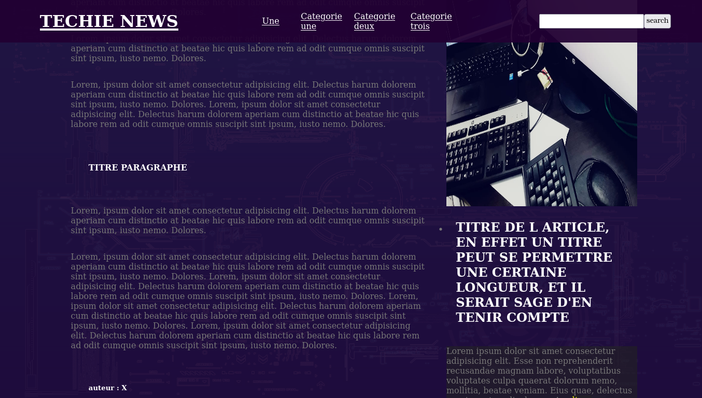

# ttemplates

>## *SIMPLY* - <a href='https://github.com/Tek-Tech/ttemplates/tree/master/simply'>Check simply On Github | Voir simply sur Github</a>

>>**SEE PREVIEW AT | VOIR L'APERCU SUR** => <a href='https://tek-tech.github.io/ttemplates/simply'>https://tek-tech.github.io/ttemplates/simply</a>

   

>## *TECHIENEWS* - <a href='https://github.com/Tek-Tech/ttemplates/tree/master/techienews'>Check Techie-News On Github | Voir Techie-News sur Github</a>

>>**SEE PREVIEW AT | VOIR L'APERCU SUR** => <a href='https://tek-tech.github.io/ttemplates/techienews'>https://tek-tech.github.io/ttemplates/techinews</a>

   

